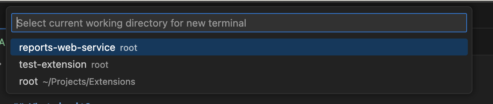
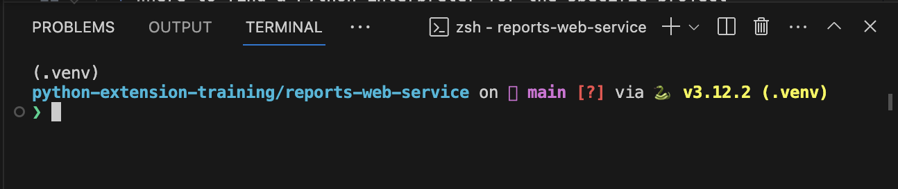

# Python Extensions Training

## What is it?

This is a public repository containing source code for internal
training focused on development of Python based extensions using 
Extension Framework 2.0.

## How is this repo structured?

This repository is structured as a Visual Studio Code workspace.
Each separate fodler is a project within the same workspace. Each folder
has its own Python virtual environment, where applicable.

### How come this works?

* Visual Studio Code relies on 2 files in the root directory of the repository:
  * `python-extension-training.code-workspace` tells is which projects are considered part of the workspace
  * `.vscode/settings.json` tells it to exclude certain folders from the root view
* Each individual project has its own `.vscode` directory with the `settings.json` file, which specifies
  * Which fiels to exclude (example: `__pycache__` cache files); and
  * Where to find a Python interpreter for the specific project folder.

## Hot to work with this repository?

1. Clone it.
2. Open the `python-extension-training.code-workspace` file with VS Code.
3. Create a separate Python virtual environment in each project
   
   Example of creating environment in `test-extension` project folder

   ```shell
   cd test-extension
   python -m venv .venv
   ```

4. When you press <kbd>Ctrl + Shift + `</kbd> or open a new terminal you can choose which project
   this terminal belongs to.
   
   

5. Once the terminal for that project opens, the virtual environment will be automatically activated:

   

6. If it's not, you can activate it manually in the terminal by navigating to the correct folder and activating it:

   Example for POSIX systems, such as Linux or macOS:

   ```shell
   cd test-extensions
   source .venv/bin/activate
   ```

   See official Python docs on [how to activate a virtual environment on different platforms](https://docs.python.org/3/library/venv.html#how-venvs-work).

7. That's it!